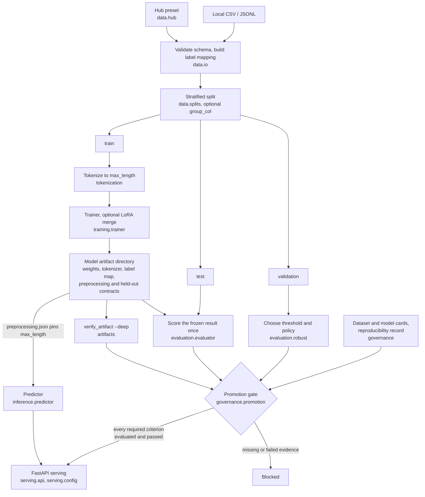

# Architecture

## High-level flow

Two things the earlier linear sketch could not show. The **validation split feeds selection
and the test split feeds scoring** — they are not interchangeable, and the test split is
never used to choose anything. And the **artifact is the hub**, not a step: evaluation,
verification, inference and the promotion gate all read the same directory, which is why its
contract is enforced rather than assumed.

## Module map (v1.0)

| Module | Responsibility |
| --- | --- |
| `hf_finetuning_lab.cli` | Stable Typer CLI: `sample-data`, `train`, `evaluate`, `predict`, `serve`, `list-hub-datasets`, `fetch-hub-dataset`, `verify-artifact`, `version`, `list-commands`. |
| `hf_finetuning_lab.artifacts` | `ArtifactReport` and `verify_artifact(model_dir)` enforce the stable artifact layout (config, weights, tokenizer, plus recommended card / metrics). |
| `hf_finetuning_lab.config` | `TrainingConfig` dataclass with YAML loading and validation. |
| `hf_finetuning_lab.data` | CSV / JSONL loading, schema validation, label mapping, stratified splits. |
| `hf_finetuning_lab.data.hub` | Hugging Face Hub presets (AG News, IMDb, Banking77, TweetEval sentiment) with split mapping and label normalization. |
| `hf_finetuning_lab.tokenization` | Tokenizer setup and preprocessing. |
| `hf_finetuning_lab.training` | Transformer / LoRA training orchestration. |
| `hf_finetuning_lab.evaluation` | Classification metrics, per-class report, calibration, threshold tuning, bootstrap CIs, subgroup metrics, prediction drift (PSI). |
| `hf_finetuning_lab.experiments` | Run IDs, dataset hashing, JSON run records, run-comparison DataFrame. |
| `hf_finetuning_lab.token_classification` | NER schema, synthetic data, subword alignment, entity-level BIO metrics. |
| `hf_finetuning_lab.retrieval` | Cosine `EmbeddingIndex`, `IndexEntry`, retrieval metrics (Recall@k, MRR, nDCG@k). |
| `hf_finetuning_lab.model_cards` | Generic model-card writer. |
| `hf_finetuning_lab.governance` | Dataset cards, task-specific model-card templates, reproducibility checklist + JSON sidecar. |
| `hf_finetuning_lab.inference` | Batch prediction from local artifacts. |
| `hf_finetuning_lab.serving` | FastAPI app with injectable predictor, lifespan warm-up, `/health/live`, `/health/ready`, structured request logger, optional Prometheus `/metrics`. |

## Stable artifact contract

A model directory produced by `hf-lab train` should contain:

- **Required:** `config.json`, `label_mapping.json`, `training_config.json`, `heldout_manifest.json`, weights (`model.safetensors`, `pytorch_model.bin`, or a sharded `*.index.json` manifest), tokenizer (`tokenizer.json`, `vocab.txt` / `vocab.json`, or a SentencePiece `spiece.model` / `tokenizer.model` / `sentencepiece.bpe.model`).
- **Recommended:** `tokenizer_config.json`, `special_tokens_map.json`, `model_card.md`, `test_metrics.json`, `preprocessing.json`.

The held-out split is described by `heldout_manifest.json` — size, label distribution, seed, fingerprint and one-way row hashes — rather than by its raw rows, so a shared model directory does not carry the evaluation text. Raw rows are opt-in through `TrainingConfig.persist_heldout_rows`.

`verify_artifact(model_dir)` (or `hf-lab verify-artifact --model-dir <path>`) walks a directory and reports each required and recommended slot with `[OK ]`, `[WARN]`, or `[MISS]`. CI can gate releases on `--strict` to also fail on warnings.

The layout pass inspects file names only, so it is fast and needs no ML dependencies — but it cannot tell a real checkpoint from placeholder files. `--deep` additionally parses the JSON, checks weight files are non-empty, compares the label mapping with the model config, rejects non-finite metrics, and asks transformers to load the tokenizer and model.

## Notebook stack

The ten notebooks under `notebooks/` walk the stack end to end:

1. End-to-end text-classification workflow (sklearn baseline + opt-in HF CLI commands).
2. Experiment management: repeated runs, dataset hashes, comparison tables.
3. Robust evaluation: calibration, thresholds, bootstrap CIs, subgroup metrics, PSI drift.
4. Hub datasets with split mapping and label normalisation (offline mock by default).
5. Token classification (NER): synthetic CoNLL data, subword alignment, entity-level metrics.
6. Semantic search: cosine index, Recall@k / MRR / nDCG@k, opt-in sentence-transformer.
7. Governance template: dataset card, task model card, reproducibility checklist.
8. Serving hardening: live/ready probes, request logs, warm-up, optional Prometheus.
9. v1.0 capstone: CLI surface, artifact verification, module map, release checklist.
10. Promotion gate: composes robust evaluation, governance artifacts and artifact verification into one fail-closed verdict.

## Runtime boundaries

- Unit tests use synthetic / offline data and avoid hidden network downloads.
- Heavy model training is supported but not required in CI.
- Hugging Face dependencies are imported close to runtime paths so lightweight code (CLI, artifact verification, serving with an injected predictor) stays usable without them.
